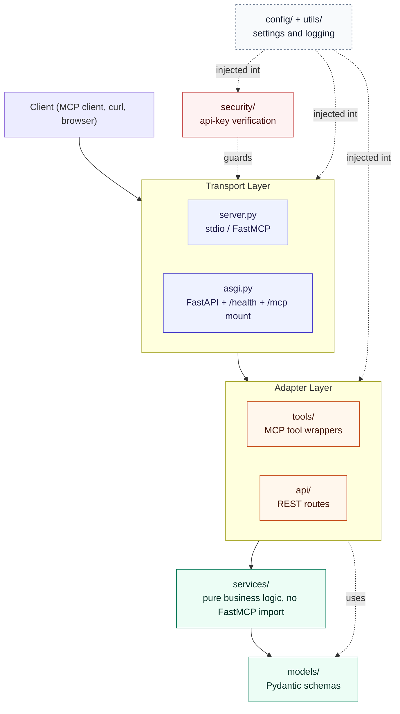
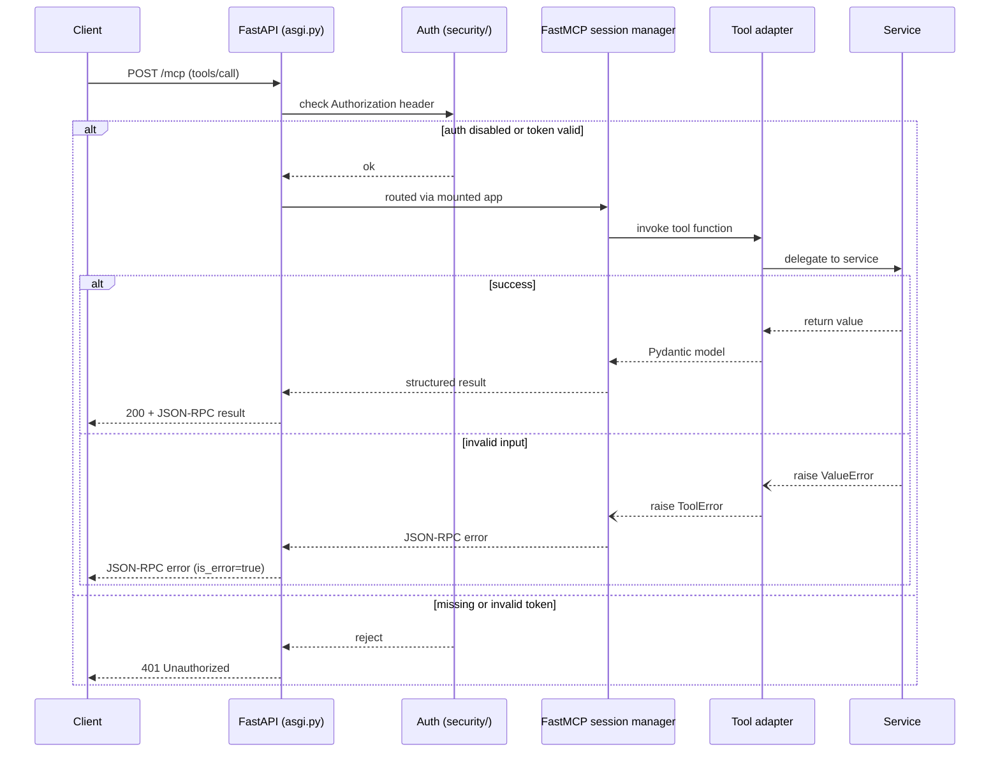
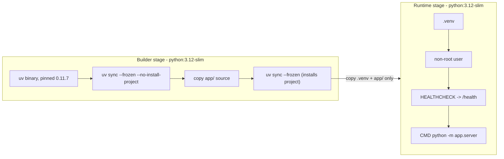

# mcp-tool-server

<div align="center">


-6b21a8)


**A production-shaped [MCP](https://modelcontextprotocol.io/) tool server** built with
[FastMCP](https://gofastmcp.com) 3, FastAPI, and Pydantic v2.

</div>

Three example tools, a REST health endpoint on the same port, opt-in API-key
auth, 100% test coverage, CI on every push, and a multi-stage Docker build —
built in eight incremental, independently-verified phases.

## Contents

- [Why this exists](#why-this-exists)
- [Architecture](#architecture)
- [Request lifecycle](#request-lifecycle)
- [Authentication](#authentication)
- [Tools](#tools)
- [Quick start](#quick-start)
- [Docker](#docker)
- [CI/CD](#cicd)
- [Configuration](#configuration)
- [Example usage](#example-usage)
- [Testing](#testing)
- [Roadmap](#roadmap)
- [License](#license)

## Why this exists

This is a reference/portfolio implementation, not a business application —
the three tools exist to demonstrate patterns (sync vs. async execution,
external I/O, structured validation, error translation, tool metadata)
rather than to solve one specific problem. A few decisions worth knowing
before you read the code:

- **Tools are decoupled from the MCP server instance.** Each tool in
  `app/tools/` builds a standalone `Tool` via `FunctionTool.from_function(...)`
  instead of decorating an existing `mcp` object. `create_server()` wires
  them in at construction time. This avoids a circular import between
  `app.server` and `app.tools`, and makes every tool callable and
  unit-testable without any MCP machinery involved.
- **Business logic doesn't know MCP exists.** `app/services/` has zero
  FastMCP imports and raises plain `ValueError`. Translation to `ToolError`
  happens once, at the `app/tools/` boundary.
- **Dependencies were added when first used, not upfront.** FastAPI wasn't
  added until the health endpoint needed it; `httpx` and `uvicorn` likewise.
  Nothing sits unused in the lockfile.
- **Auth is opt-in, not bolted on as an afterthought.** `app/security/`
  holds one job: verify a bearer token. It's a `TokenVerifier` FastMCP
  already knows how to consume, not a custom middleware reinventing that.
- **Two ASGI apps, one port** — see [Architecture](#architecture) below.

## Architecture



Dependency direction is one-way: **transport → adapters → services → models.**
Nothing in `services/` or `models/` imports anything above it — that's what
keeps business logic testable without spinning up any MCP or HTTP machinery.

```
.github/workflows/  # CI: lint + type-check + test, and a Docker build/smoke-test job
app/
├── server.py       # create_server(): builds the FastMCP instance + tool registry
├── asgi.py         # create_asgi_app(mcp, settings): mounts FastMCP into FastAPI for the http transport
├── config/         # Environment-driven settings (Pydantic v2 / pydantic-settings)
├── utils/          # Logging and other cross-cutting helpers
├── security/       # Opt-in API-key bearer-token verification
├── api/            # Plain REST routes (currently just /health, never auth-gated)
├── tools/          # MCP tool adapters: schema, metadata, ValueError -> ToolError translation
├── services/       # Pure business logic. No FastMCP import, anywhere.
└── models/         # Pydantic schemas shared by tools/services/api
tests/              # 45 tests, 100% line coverage (unit + integration, no real network calls)
```

## Request lifecycle

The one genuine gotcha in this codebase: `mcp.http_app()` returns a
Starlette app whose session manager only starts if its `lifespan` is
explicitly handed to the *parent* FastAPI app. Skip that and `/health`
works fine while every tool call fails with a task-group error — confirmed
the hard way during Phase 3 (see `app/asgi.py`). The diagram below is what
it looks like once that's wired correctly:



`/health` is simpler — it never touches the MCP session manager, or the auth
check, at all; it's a plain FastAPI route that reads settings via dependency
injection (see [Testing](#testing) for a real bug that caught).

## Authentication

Off by default, on by setting one environment variable:

```bash
MCP_API_KEYS=key-for-client-a,key-for-client-b
```

- **Empty (default): no auth.** Anyone who can reach the port can call any
  tool. Fine for local exploration; not fine for anything reachable outside
  your own machine.
- **Set: bearer-token auth on `/mcp`, enforced by FastMCP itself.**
  `app/security/api_key_auth.py` implements `TokenVerifier` — the
  resource-server pattern FastMCP already understands, not a hand-rolled
  middleware — checking each token against the configured set with
  `hmac.compare_digest` (constant-time, so a valid key can't be inferred
  faster via response-timing side channels).
- **`/health` is never gated**, on purpose — infrastructure checking
  liveness (Docker's `HEALTHCHECK`, a load balancer, a k8s probe) shouldn't
  need credentials just to know the process is up.
- **Multiple keys, not one shared secret** — supports rotation: issue a new
  key, roll it out, then remove the old one from `MCP_API_KEYS` without any
  downtime.

This is deliberately a *pre-shared-key* scheme, appropriate for a small
number of known/trusted callers. `fastmcp.server.auth.providers` bundles
real OAuth/OIDC integrations (Auth0, WorkOS, GitHub, and others) for when
per-user identity or third-party client registration is actually needed —
reach for one of those rather than extending `ApiKeyVerifier` into
something it isn't.

```python
from fastmcp import Client

async with Client("http://localhost:8000/mcp", auth="key-for-client-a") as client:
    await client.call_tool("analyze_text", {"text": "Hello!"})
```

## Tools

| Tool | Style | Tags | Description |
| --- | --- | --- | --- |
| `analyze_text` | sync | `text`, `utility` | Word/character/sentence counts and an estimated reading time. |
| `fetch_url_metadata` | async | `network`, `utility` | Status code, headers, and response time for an http/https URL. Only transport failures raise — a 404 is valid data. |
| `convert_temperature` | sync | `math`, `utility` | Convert between celsius, fahrenheit, and kelvin; rejects values below absolute zero. |

Each carries MCP tool annotations (`readOnlyHint`, `idempotentHint` /
`openWorldHint`) so clients can reason about side effects before calling them.

## Quick start

```bash
uv sync
cp .env.example .env
uv run python -m app.server
```

This starts the `http` transport on `http://0.0.0.0:8000`, serving both
`/health` and the MCP endpoint at `/mcp`. Set `MCP_TRANSPORT=stdio` in `.env`
instead if a client (e.g. Claude Desktop) will spawn this process directly.

## Docker

```bash
cp .env.example .env
docker compose up --build
```



Dependencies are synced in the builder stage from the lockfile *before* any
application code is copied in, so rebuilds only reinstall packages when
`uv.lock` actually changes. The runtime stage carries only the built virtual
environment and `app/` — no `uv`, no lockfile, no tests, no dev dependencies.

```bash
# without compose
docker build -t mcp-tool-server .
docker run --rm -p 8000:8000 --env-file .env -e MCP_HOST=0.0.0.0 mcp-tool-server
```

> **Note:** this Dockerfile follows the standard multi-stage `uv` pattern and
> was reviewed carefully, but this sandbox had no Docker daemon available to
> actually run `docker build` against — unlike the rest of this project, it
> wasn't executed end-to-end here. The `docker` job in
> [`.github/workflows/ci.yml`](.github/workflows/ci.yml) builds and
> smoke-tests the image on every push, which is where this actually gets
> verified — check that it's green before relying on the image.

## CI/CD

Two jobs, on every push and PR to `main`:

| Job | What it runs |
| --- | --- |
| `test` | `ruff check .`, `mypy app`, `uv run pytest` (100% coverage enforced by the test suite itself, not a separate gate) |
| `docker` | `docker build`, then runs the image and polls `/health` until it's up — the actual verification this project's Dockerfile didn't get locally (see the note above) |

`astral-sh/setup-uv` and `actions/checkout` are pinned to a specific commit
SHA rather than a mutable tag (`@v9.0.0` as a comment for readability, but
the SHA is what actually runs) — a floating tag can be repointed by whoever
controls the action's repo; a SHA can't. Standard supply-chain hardening
for anything that runs arbitrary code in CI.

## Configuration

All variables are optional and prefixed `MCP_`; see `.env.example` for the
full, commented list. The ones worth knowing about:

| Variable | Default | Notes |
| --- | --- | --- |
| `MCP_TRANSPORT` | `http` | `stdio` for direct process spawning, `http` for a network service |
| `MCP_HOST` / `MCP_PORT` | `0.0.0.0` / `8000` | Only used for the `http` transport |
| `MCP_ENVIRONMENT` | `development` | `development` \| `staging` \| `production` |
| `MCP_LOG_LEVEL` | `INFO` | Standard library log level name |
| `MCP_API_KEYS` | *(empty)* | Comma-separated bearer tokens; empty disables auth entirely — see [Authentication](#authentication) |
| `FASTMCP_CHECK_FOR_UPDATES` | `stable` | FastMCP pings PyPI on startup by default; set `off` in production |

## Example usage

**Health check:**

```bash
curl http://localhost:8000/health
# {"status":"ok","name":"mcp-tool-server","version":"0.1.0","environment":"development"}
```

**Calling a tool** — the MCP endpoint is a stateful, session-based protocol
(not plain REST; see [Request lifecycle](#request-lifecycle)), so the
practical way to call it is `fastmcp`'s own client rather than raw curl:

```python
import asyncio
from fastmcp import Client

async def main():
    async with Client("http://localhost:8000/mcp") as client:
        result = await client.call_tool(
            "convert_temperature",
            {"value": 100, "from_unit": "celsius", "to_unit": "fahrenheit"},
        )
        print(result.data)  # output_value=212.0 ...

asyncio.run(main())
```

Or in-memory, against the server object directly (no network at all — this
is exactly what the test suite does):

```python
from fastmcp import Client
from app.server import mcp

async with Client(mcp) as client:
    tools = await client.list_tools()
```

## Testing

```bash
uv run pytest              # 45 tests, coverage report on by default (see pyproject.toml)
uv run ruff check .
uv run mypy app
```

The same three commands run in CI on every push — see [CI/CD](#cicd).

Coverage is 100% across all 244 statements in `app/`. That number is a
byproduct of testing real behavior (every tool's error path, the settings
validation, the `main()` transport dispatch, the FastAPI lifespan wiring),
not a target chased for its own sake — the last few percentage points came
directly from `pytest --cov-report=term-missing` pointing at genuine gaps,
including two real bugs it caught:

- `create_asgi_app(settings)` accepted a `settings` argument that the
  health route was silently ignoring in favor of the global cached
  singleton (FastAPI's `Depends(get_settings)` doesn't know about a
  `settings` value constructed elsewhere unless you override the
  dependency) — fixed with a dependency override in `app/asgi.py`.
- Testing auth by connecting `fastmcp.Client` directly to the in-memory
  `FastMCP` instance silently passed with *no* token required, regardless
  of configuration — because that transport bypasses HTTP (and therefore
  headers) entirely, not because auth was broken. It also revealed
  `create_asgi_app` was closing over a module-level app built from default
  settings at import time, so passing different auth config into it did
  nothing. Both are fixed: `create_asgi_app(mcp, settings)` now takes the
  server instance explicitly, and auth tests go through real HTTP via
  `TestClient` with an actual `Authorization` header (`tests/test_auth.py`).

Network-dependent tests (`test_web_service.py`) use `httpx.MockTransport` —
no real HTTP calls, no flakiness, no dependency on network access in
whatever environment runs the suite.

## Roadmap

- [x] Phase 1 — Architecture & project initialization
- [x] Phase 2 — Example tools + tool metadata
- [x] Phase 3 — FastAPI mounting + health endpoint
- [x] Phase 4 — Full unit test suite
- [x] Phase 5 — Docker + docker-compose
- [x] Phase 6 — Full documentation pass
- [x] Phase 7 — CI/CD (GitHub Actions: lint/type/test + Docker build & smoke test)
- [x] Phase 8 — Opt-in API-key authentication for the MCP endpoint

## License

MIT — see [LICENSE](LICENSE).
