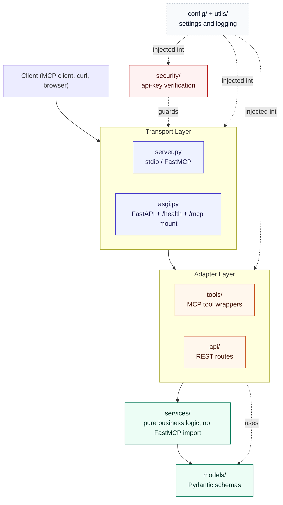
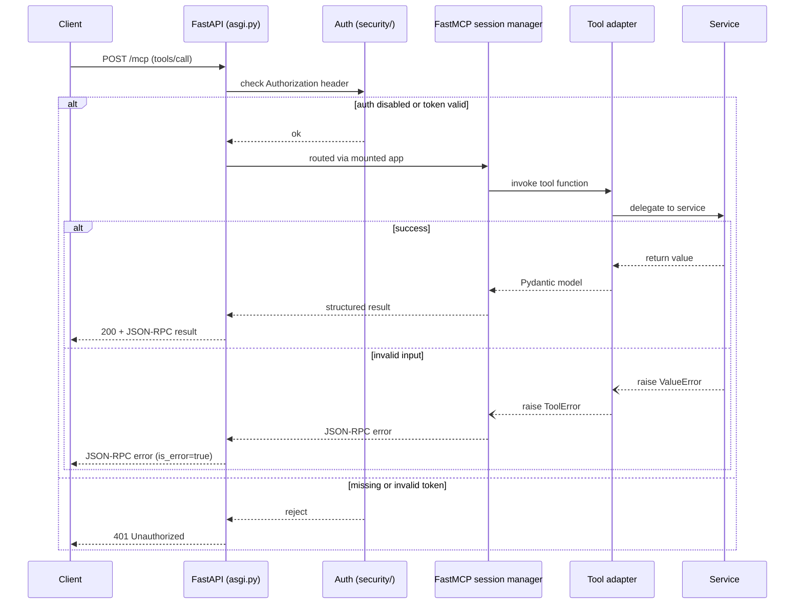
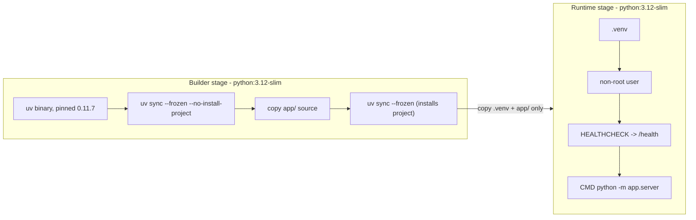
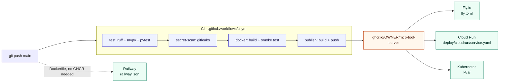
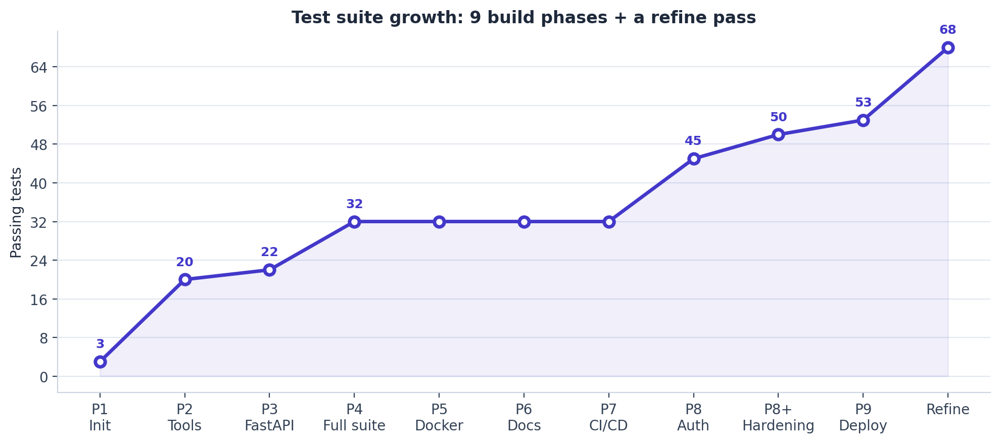
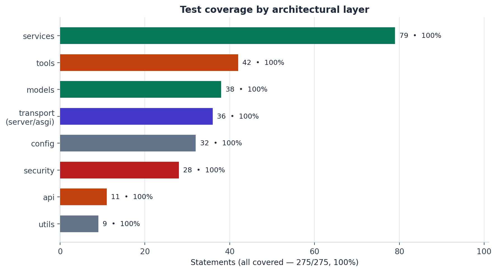
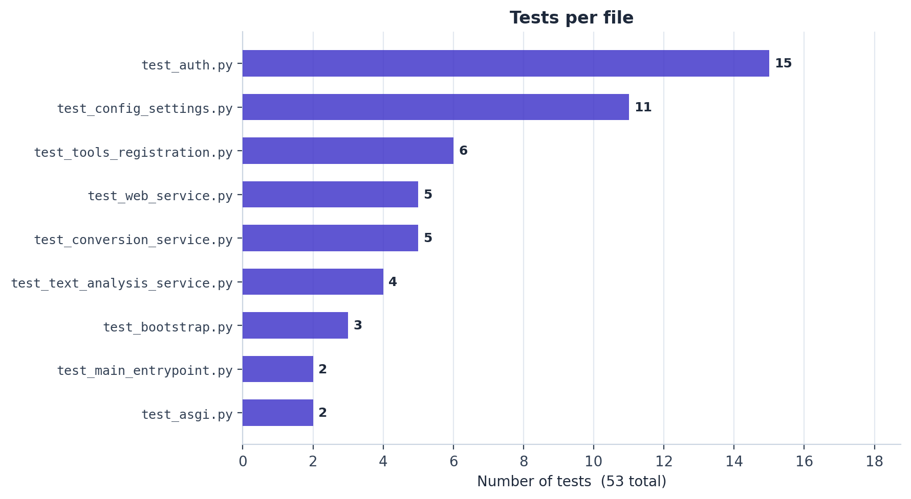

# mcp-tool-server

<div align="center">


**A production-shaped [MCP](https://modelcontextprotocol.io/) tool server** built with
[FastMCP](https://gofastmcp.com) 3, FastAPI, and Pydantic v2.

</div>

Three example tools, a REST health endpoint on the same port, opt-in API-key
auth, 100% test coverage, CI that publishes a real image on every merge, and
ready-to-use deployment configs for Fly.io, Cloud Run, Kubernetes, and Railway —
built in nine incremental, independently-verified phases.

## Contents

- [Why this exists](#why-this-exists)
- [Architecture](#architecture)
- [Request lifecycle](#request-lifecycle)
- [Authentication](#authentication)
- [Tools](#tools)
- [Quick start](#quick-start)
- [Docker](#docker)
- [CI/CD](#cicd)
- [Deployment](#deployment)
- [Configuration](#configuration)
- [Example usage](#example-usage)
- [Testing](#testing)
- [Roadmap](#roadmap)
- [License](#license)

## Why this exists

This is a reference/portfolio implementation, not a business application —
the three tools exist to demonstrate patterns (sync vs. async execution,
external I/O, structured validation, error translation, tool metadata)
rather than to solve one specific problem. A few decisions worth knowing
before you read the code:

- **Tools are decoupled from the MCP server instance.** Each tool in
  `app/tools/` builds a standalone `Tool` via `FunctionTool.from_function(...)`
  instead of decorating an existing `mcp` object. `create_server()` wires
  them in at construction time. This avoids a circular import between
  `app.server` and `app.tools`, and makes every tool callable and
  unit-testable without any MCP machinery involved.
- **Business logic doesn't know MCP exists.** `app/services/` has zero
  FastMCP imports and raises plain `ValueError`. Translation to `ToolError`
  happens once, at the `app/tools/` boundary.
- **Dependencies were added when first used, not upfront.** FastAPI wasn't
  added until the health endpoint needed it; `httpx` and `uvicorn` likewise.
  Nothing sits unused in the lockfile.
- **Auth is opt-in, not bolted on as an afterthought.** `app/security/`
  holds one job: verify a bearer token. It's a `TokenVerifier` FastMCP
  already knows how to consume, not a custom middleware reinventing that.
- **A tool that fetches arbitrary URLs, called by an AI agent, is an SSRF
  vector by default.** `fetch_url_metadata` resolves the hostname and
  checks the actual IP before ever connecting — a caller (or a model
  prompt-injected into calling it) pointing it at `169.254.169.254`
  (cloud instance metadata) or an internal `10.x`/`192.168.x` address
  gets refused, not a credential leak. Scoped deliberately: this closes
  the direct case, not DNS rebinding, which needs transport-layer
  enforcement rather than a pre-request check like this one.
- **Two ASGI apps, one port** — see [Architecture](#architecture) below.

## Architecture



Dependency direction is one-way: **transport → adapters → services → models.**
Nothing in `services/` or `models/` imports anything above it — that's what
keeps business logic testable without spinning up any MCP or HTTP machinery.

```
.github/workflows/  # CI: lint + type-check + test, secret scan, Docker build/smoke-test, GHCR publish
fly.toml             # Fly.io deployment config
railway.json          # Railway deployment config
deploy/cloudrun/      # Cloud Run declarative service spec
k8s/                  # Kubernetes manifests (Deployment, Service, HPA, ConfigMap, Secret template)
assets/               # README charts (PNG, generated from real data -- see scripts/)
scripts/              # generate_charts.py: regenerates assets/*.png; not part of the app
app/
├── server.py       # create_server(): builds the FastMCP instance + tool registry
├── asgi.py         # create_asgi_app(mcp, settings): mounts FastMCP into FastAPI for the http transport
├── config/         # Environment-driven settings (Pydantic v2 / pydantic-settings)
├── utils/          # Logging and other cross-cutting helpers
├── security/       # Opt-in API-key bearer-token verification
├── api/            # Plain REST routes (currently just /health, never auth-gated)
├── tools/          # MCP tool adapters: schema, metadata, ValueError -> ToolError translation
├── services/       # Pure business logic. No FastMCP import, anywhere.
└── models/         # Pydantic schemas shared by tools/services/api
tests/              # 68 tests, 100% line coverage (unit + integration, no real network calls)
```

## Request lifecycle

The one genuine gotcha in this codebase: `mcp.http_app()` returns a
Starlette app whose session manager only starts if its `lifespan` is
explicitly handed to the *parent* FastAPI app. Skip that and `/health`
works fine while every tool call fails with a task-group error — confirmed
the hard way during Phase 3 (see `app/asgi.py`). The diagram below is what
it looks like once that's wired correctly:



`/health` is simpler — it never touches the MCP session manager, or the auth
check, at all; it's a plain FastAPI route that reads settings via dependency
injection (see [Testing](#testing) for a real bug that caught).

## Authentication

Off by default, on by setting one environment variable:

```bash
MCP_API_KEYS=key-for-client-a,key-for-client-b
```

- **Empty (default): no auth.** Anyone who can reach the port can call any
  tool. Fine for local exploration; not fine for anything reachable outside
  your own machine.
- **Set: bearer-token auth on `/mcp`, enforced by FastMCP itself.**
  `app/security/api_key_auth.py` implements `TokenVerifier` — the
  resource-server pattern FastMCP already understands, not a hand-rolled
  middleware — checking each token against the configured set with
  `hmac.compare_digest` (constant-time, so a valid key can't be inferred
  faster via response-timing side channels).
- **`/health` is never gated**, on purpose — infrastructure checking
  liveness (Docker's `HEALTHCHECK`, a load balancer, a k8s probe) shouldn't
  need credentials just to know the process is up.
- **Multiple keys, not one shared secret** — supports rotation: issue a new
  key, roll it out, then remove the old one from `MCP_API_KEYS` without any
  downtime.

This is deliberately a *pre-shared-key* scheme, appropriate for a small
number of known/trusted callers. `fastmcp.server.auth.providers` bundles
real OAuth/OIDC integrations (Auth0, WorkOS, GitHub, and others) for when
per-user identity or third-party client registration is actually needed —
reach for one of those rather than extending `ApiKeyVerifier` into
something it isn't.

```python
from fastmcp import Client

async with Client("http://localhost:8000/mcp", auth="key-for-client-a") as client:
    await client.call_tool("analyze_text", {"text": "Hello!"})
```

**Keeping keys out of logs and the repo, specifically:**

- Every configured/submitted token is logged, if at all, only through
  `mask_token()` — a short prefix and a length (`"a-re...(34 chars)"`),
  enforced by tests that assert the *real* value never appears in
  `caplog` output for either a successful or failed check
  (`tests/test_auth.py`). Before this, `verify_token` logged nothing at
  all about auth attempts — a real observability gap, not a deliberate
  safety choice, closed alongside the masking rather than left as a TODO.
- Confirmed directly (not assumed) that neither FastMCP's own 401 response
  body/headers nor its internal log line echo back a submitted token or a
  configured key — checked with a real request carrying a token designed
  to be obviously identifiable if it leaked.
- `.github/workflows/ci.yml` runs [`gitleaks`](https://github.com/gitleaks/gitleaks)
  against full git history on every push and PR, and `publish` won't run
  if it finds anything — installed as the plain open-source binary
  directly rather than via the official `gitleaks-action` wrapper, which
  requires a paid license for organization (not personal) accounts as of
  v3. Verified locally against this exact repo (clean) and against a
  planted fake credential in an isolated scratch repo (correctly caught,
  exit code 1) before being wired into CI.
- No real key has ever existed in this repository — `.env.example` ships
  the variable empty, `k8s/secret.example.yaml` is obvious placeholder
  text and is deliberately excluded from `kustomization.yaml`, and every
  value that looks like a key in tests or docs (`"secret-key"`,
  `"key-for-client-a"`, ...) is a fixture, confirmed by running `gitleaks`
  itself against the repo, not just by eyeballing it.

## Tools

| Tool | Style | Tags | Description |
| --- | --- | --- | --- |
| `analyze_text` | sync | `text`, `utility` | Word/character/sentence counts and an estimated reading time. |
| `fetch_url_metadata` | async | `network`, `utility` | Status code, headers, and response time for an http/https URL. Refuses hosts that resolve to a private/internal address (SSRF protection — see [Why this exists](#why-this-exists)). Only transport failures raise — a 404 is valid data. |
| `convert_temperature` | sync | `math`, `utility` | Convert between celsius, fahrenheit, and kelvin; rejects values below absolute zero. |

Each carries MCP tool annotations (`readOnlyHint`, `idempotentHint` /
`openWorldHint`) so clients can reason about side effects before calling them.

## Quick start

```bash
uv sync
cp .env.example .env
uv run python -m app.server
```

This starts the `http` transport on `http://0.0.0.0:8000`, serving both
`/health` and the MCP endpoint at `/mcp`. Set `MCP_TRANSPORT=stdio` in `.env`
instead if a client (e.g. Claude Desktop) will spawn this process directly.

## Docker

```bash
cp .env.example .env
docker compose up --build
```



Dependencies are synced in the builder stage from the lockfile *before* any
application code is copied in, so rebuilds only reinstall packages when
`uv.lock` actually changes. The runtime stage carries only the built virtual
environment and `app/` — no `uv`, no lockfile, no tests, no dev dependencies.

```bash
# without compose
docker build -t mcp-tool-server .
docker run --rm -p 8000:8000 --env-file .env -e MCP_HOST=0.0.0.0 mcp-tool-server
```

> **Note:** this Dockerfile follows the standard multi-stage `uv` pattern and
> was reviewed carefully, but this sandbox had no Docker daemon available to
> actually run `docker build` against — unlike the rest of this project, it
> wasn't executed end-to-end here. The `docker` job in
> [`.github/workflows/ci.yml`](.github/workflows/ci.yml) builds and
> smoke-tests the image on every push, which is where this actually gets
> verified — check that it's green before relying on the image.

## CI/CD

Four jobs. `test`, `secret-scan`, and `docker` run on every push and PR to
`main`; `publish` only runs on push to `main`, and only if the other three
all pass:

| Job | What it runs |
| --- | --- |
| `test` | `ruff check .`, `mypy app`, `uv run pytest` (100% coverage enforced by the test suite itself, not a separate gate) |
| `secret-scan` | `gitleaks` against full git history — see [Authentication](#authentication) for why it's the plain binary, not the official action |
| `docker` | `docker build`, then runs the image and polls `/health` until it's up — the actual verification this project's Dockerfile didn't get locally (see the note above) |
| `publish` | Only on push to `main`, and only if `test`, `secret-scan`, and `docker` all pass: builds and pushes to `ghcr.io/OWNER/mcp-tool-server` (`:latest` and `:sha-xxxxxxx`) — see [Deployment](#deployment) |

`astral-sh/setup-uv` and `actions/checkout` are pinned to a specific commit
SHA rather than a mutable tag (`@v9.0.0` as a comment for readability, but
the SHA is what actually runs) — a floating tag can be repointed by whoever
controls the action's repo; a SHA can't. Standard supply-chain hardening
for anything that runs arbitrary code in CI.

## Deployment

This is a stateless, single-process HTTP service with every setting
externalized to environment variables — about as close to "deploy anywhere
that runs a container" as an app gets. Four concrete targets are checked
in rather than just described:



The `publish` job in CI builds and pushes to GHCR on every merge to `main`
(after `test` and `docker` both pass, not before) — that's what makes the
manifests below reference a real, pullable image instead of a hypothetical
one. Replace `OWNER` in each file with the actual GitHub owner/repo.

| Target | File | Notes |
| --- | --- | --- |
| **Fly.io** | [`fly.toml`](fly.toml) | Fastest path to a live URL. `fly launch --no-deploy` once, then `fly deploy`. `kill_signal = "SIGTERM"` is set explicitly — Fly's own default is SIGINT, and this keeps shutdown behavior identical across all targets. |
| **Cloud Run** | [`deploy/cloudrun/service.yaml`](deploy/cloudrun/service.yaml) | Declarative Knative spec; `gcloud run services replace` to apply. Startup/liveness probes against `/health` mirror Kubernetes probe syntax directly. |
| **Kubernetes** | [`k8s/`](k8s/) | `deployment.yaml` (security-hardened: non-root uid 1000 matching the Dockerfile, read-only root filesystem, all capabilities dropped, a `preStop` sleep so rolling updates drain cleanly), `service.yaml`, `configmap.yaml`, `hpa.yaml` (2-10 replicas on 70% CPU), and `secret.example.yaml` — a template, deliberately excluded from `kustomization.yaml` so it's never accidentally applied as-is. `kubectl apply -k k8s/`. |
| **Railway** | [`railway.json`](railway.json) | Detects the Dockerfile directly — connect the repo and it deploys, no GHCR step needed. `restartPolicyType: "ON_FAILURE"`, not `"ALWAYS"`: the latter restarts even on an intentional shutdown, which isn't what you want for a normal deploy/redeploy cycle. Unlike the other three, `MCP_ENVIRONMENT=production` isn't set anywhere in this repo for Railway — Railway variables live in its dashboard/CLI, not in `railway.json` — so set it there if you want `/docs` disabled (see [Configuration](#configuration)) the same way it already is on Fly/Cloud Run/Kubernetes. |

**Railway specifically needed a real code fix, not just a config file.**
Fly/Cloud Run/Kubernetes all let *you* pick a fixed port and configure the
platform to route to it. Railway instead assigns a port dynamically and
injects it as a bare `PORT` env var with no way to rename it — and this
app only read `MCP_PORT`. Without a fix, Railway would've considered the
deploy healthy at the container level while every request 404'd at the
edge, since traffic would arrive on the port *Railway* picked while the
app listened on 8000 regardless. Fixed in `app/config/settings.py` with
`validation_alias=AliasChoices("MCP_PORT", "PORT")` — `MCP_PORT` still
wins if both are set, so this is purely additive for every other target.
One second-order bug surfaced while fixing the first: the Dockerfile baked
`MCP_PORT=8000` in as an image-level default, which — since `MCP_PORT`
takes precedence — would have silently shadowed Railway's real port on
every deploy regardless of the fix above. Removed; `app/config/settings.py`
already defaults to 8000 on its own with no env var set at all, so the
Dockerfile default was pure redundancy that happened to also be actively
wrong for this one target. Verified with a real boot under simulated
Railway conditions (`PORT` set, `MCP_PORT` deliberately absent) — the app
came up on the assigned port and, just as importantly, confirmed *not*
listening on 8000 at all.

**Secrets, consistently:** `MCP_API_KEYS` is never written into any of
these files. Fly uses `fly secrets set`; Cloud Run uses Secret Manager via
`--set-secrets` (a commented `secretKeyRef` block shows where); Kubernetes
uses a separately-created `Secret` that the Deployment references with
`optional: true`; Railway uses its dashboard/CLI Variables (`railway
variables set`) — so the app runs identically with or without it,
matching [Authentication](#authentication)'s "empty means disabled"
default.

**On graceful shutdown:** uvicorn drains in-flight requests on `SIGTERM` by
default; this was exercised (not just assumed) throughout development via
`timeout N uv run python -m app.server`, which sends `SIGTERM` and waits —
every such run exited cleanly on its own well within the timeout, with no
forced `SIGKILL` needed. The Kubernetes manifest's `preStop` hook and
`terminationGracePeriodSeconds: 30` build in margin around that same path
for rolling updates specifically.

> **Same caveat as the Dockerfile itself:** these four configs were
> written carefully and cross-checked against each platform's current
> documentation (both Fly's and Railway's schemas have changed before), and
> validated for syntax — but none were applied against a real Fly app, GCP
> project, or cluster from this sandbox. Treat first deploys accordingly.

## Configuration

All variables are optional and prefixed `MCP_`; see `.env.example` for the
full, commented list. The ones worth knowing about:

| Variable | Default | Notes |
| --- | --- | --- |
| `MCP_TRANSPORT` | `http` | `stdio` for direct process spawning, `http` for a network service |
| `MCP_HOST` / `MCP_PORT` | `0.0.0.0` / `8000` | Only used for the `http` transport |
| `MCP_ENVIRONMENT` | `development` | `development` \| `staging` \| `production`. `production` also disables `/docs`, `/redoc`, and `/openapi.json`. |
| `MCP_LOG_LEVEL` | `INFO` | Standard library log level name |
| `MCP_API_KEYS` | *(empty)* | Comma-separated bearer tokens; empty disables auth entirely — see [Authentication](#authentication) |
| `FASTMCP_CHECK_FOR_UPDATES` | `stable` | FastMCP pings PyPI on startup by default; set `off` in production |

## Example usage

**Health check:**

```bash
curl http://localhost:8000/health
# {"status":"ok","name":"mcp-tool-server","version":"0.1.0","environment":"development"}
```

**Calling a tool** — the MCP endpoint is a stateful, session-based protocol
(not plain REST; see [Request lifecycle](#request-lifecycle)), so the
practical way to call it is `fastmcp`'s own client rather than raw curl:

```python
import asyncio
from fastmcp import Client

async def main():
    async with Client("http://localhost:8000/mcp") as client:
        result = await client.call_tool(
            "convert_temperature",
            {"value": 100, "from_unit": "celsius", "to_unit": "fahrenheit"},
        )
        print(result.data)  # output_value=212.0 ...

asyncio.run(main())
```

Or in-memory, against the server object directly (no network at all — this
is exactly what the test suite does):

```python
from fastmcp import Client
from app.server import mcp

async with Client(mcp) as client:
    tools = await client.list_tools()
```

## Testing

```bash
uv run pytest              # 68 tests, coverage report on by default (see pyproject.toml)
uv run ruff check .
uv run mypy app
```

The same three commands run in CI on every push — see [CI/CD](#cicd).

<p align="center">
  
</p>

Real milestones, not a smoothed curve — Phases 5-7 (Docker, docs, CI/CD)
genuinely added no new Python tests, and the chart shows that flat instead
of hiding it. The two jumps are Phase 4 (closing coverage gaps found by
`--cov-report=term-missing`) and Phase 8 (auth plus the masked-logging
hardening that came out of testing it). The final point is a refine pass
over the finished project — see below.

Coverage is 100% across all 275 statements in `app/`, and `pyproject.toml`
sets `fail_under = 100` so that claim is enforced, not just true today by
coincidence: `uv run pytest` exits non-zero the moment coverage drops below
100%, verified with a positive control (a deliberately uncovered function,
confirmed to fail the build, then removed) rather than taken on faith. That
number is a byproduct of testing real behavior (every tool's error path,
the settings validation, the `main()` transport dispatch, the FastAPI
lifespan wiring), not a target chased for its own sake — the last few
percentage points came directly from `pytest --cov-report=term-missing`
pointing at genuine gaps, including two real bugs it caught:

- `create_asgi_app(settings)` accepted a `settings` argument that the
  health route was silently ignoring in favor of the global cached
  singleton (FastAPI's `Depends(get_settings)` doesn't know about a
  `settings` value constructed elsewhere unless you override the
  dependency) — fixed with a dependency override in `app/asgi.py`.
- Testing auth by connecting `fastmcp.Client` directly to the in-memory
  `FastMCP` instance silently passed with *no* token required, regardless
  of configuration — because that transport bypasses HTTP (and therefore
  headers) entirely, not because auth was broken. It also revealed
  `create_asgi_app` was closing over a module-level app built from default
  settings at import time, so passing different auth config into it did
  nothing. Both are fixed: `create_asgi_app(mcp, settings)` now takes the
  server instance explicitly, and auth tests go through real HTTP via
  `TestClient` with an actual `Authorization` header (`tests/test_auth.py`).
- A later refine pass over the (by then "finished") project found two
  more, of a different kind — not missing tests, but dead or misleading
  surface area that had accumulated: `is_production` was defined, tested,
  and never actually used anywhere, and `MCP_TRANSPORT` accepted `"sse"`
  as a value that silently did nothing (never forwarded to
  `mcp.http_app()`). Fixed by wiring `is_production` to actually disable
  FastAPI's `/docs`, `/redoc`, and `/openapi.json` in production, and by
  removing `"sse"` rather than leaving an option on that doesn't work —
  offering a config value that's silently a no-op is worse than not
  offering it. Also caught, in the same pass: a Dockerfile comment
  describing the `MCP_PORT`/`PORT` fallback precedence *backwards* from
  what the code directly below it actually did.
- A further pass, reading `fetch_url_metadata` specifically with a
  security lens rather than a correctness one, found the SSRF gap
  described above. Fixing it exposed a second issue in the fix itself:
  the obvious implementation does real DNS resolution before ever
  touching the (correctly mocked) HTTP client, which would have silently
  made every existing `MockTransport`-based test in this file dependent
  on real DNS working from wherever the suite happened to run — exactly
  what mocking the transport was supposed to prevent, just one layer
  down. Fixed by injecting the resolver the same way the HTTP client
  already was, then verified the fix against the actual attack it closes:
  a real MCP tool call to `169.254.169.254` (cloud metadata) through the
  full stack, blocked; a real call to a genuine public site, unaffected.

<p align="center">
  
  <br>
  
</p>

Bar colors in the first chart match the architecture diagram above —
green for the core layer (services/models), orange for adapters
(tools/api), indigo for transport, red for security — so the two visuals
read as one system rather than two unrelated ones. `services` carries the
most weight (79 statements) for the same reason it's the layer this
project cares most about testing in isolation: it's where the actual
business logic lives, deliberately kept free of any FastMCP import (see
[Why this exists](#why-this-exists)). `test_web_service.py` is the largest
test file — 17 cases from 11 test functions, since the SSRF check is
verified with a `@pytest.mark.parametrize` matrix across seven different
blocked-address ranges rather than one test per range copy-pasted; by raw
function count `test_auth.py` (15) is still larger, which tracks with why
auth got its own [dedicated section](#authentication) — it's the other
piece of this codebase with real security consequences if it's wrong.

Both charts are generated from real, freshly-measured data (a live
`pytest --cov` run, `grep -c "def test_"` across `tests/*.py`, and the
exact milestone numbers observed during this project's own build — see
the growth chart above) by [`scripts/generate_charts.py`](scripts/generate_charts.py),
not hand-drawn. Re-run it after the test suite changes enough to make the
numbers stale.

Network-dependent tests (`test_web_service.py`) use `httpx.MockTransport` —
no real HTTP calls, no flakiness, no dependency on network access in
whatever environment runs the suite.

## Roadmap

- [x] Phase 1 — Architecture & project initialization
- [x] Phase 2 — Example tools + tool metadata
- [x] Phase 3 — FastAPI mounting + health endpoint
- [x] Phase 4 — Full unit test suite
- [x] Phase 5 — Docker + docker-compose
- [x] Phase 6 — Full documentation pass
- [x] Phase 7 — CI/CD (GitHub Actions: lint/type/test + Docker build & smoke test)
- [x] Phase 8 — Opt-in API-key authentication for the MCP endpoint (+ masked audit logging, `gitleaks` in CI)
- [x] Phase 9 — Deployability: GHCR image publish + Fly.io / Cloud Run / Kubernetes / Railway configs
- [x] Refine pass — no new features; closed gaps a fresh critical read found in the "finished" project: dead `is_production` property (now wired to gate `/docs` in production), a `MCP_TRANSPORT` value that silently did nothing, a backwards precedence comment in the Dockerfile, `fail_under = 100` so the coverage claim is enforced rather than just currently true, and an SSRF gap in `fetch_url_metadata` (arbitrary-URL tools called by AI agents are a real attack surface) closed with DNS-resolution-based address checking

## License

MIT — see [LICENSE](LICENSE).
